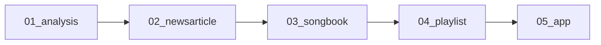

# Multibase Project

This document outlines the Multibase project workflow and deliverables. Each step creates a standalone product that can be delivered upon completion.

## Project Pipeline

## Workflow Stages

### 01_analysis
- **Purpose**: Analyze Kusama blockchain transaction data
- **Components**:
  - Subsquid Indexer to extract Kusama blockchain data
    - Transfers
    - Timestamps for each transfer
  - Data processing into monthly aggregates
- **Output**: `analysis.md` - Comprehensive transaction analysis document
- **Deliverable**: Analysis Paper on Kusama blockchain activity

### 02_newsarticle
- **Purpose**: Generate relevant news articles for each time period
- **Process**: 
  - Query Perplexity for major Kusama ecosystem news by month/year
  - Format as structured news articles
- **Output**: `news_<month>.md` files
- **Deliverable**: Newspaper-style collection of Kusama ecosystem news

### 03_songbook
- **Purpose**: Transform news into lyrics
- **Process**:
  - Convert news articles into appropriate lyrics
  - Format with proper song structure
- **Output**: `lyrics_<month>.md` files
- **Deliverable**: Songbook collection for Kusama

### 04_playlist
- **Purpose**: Generate music from lyrics
- **Process**:
  - Create songs based on lyrics with dynamic styles
  - Transaction volume influences music style:
    - Low transaction months → Low BPM music
    - High transaction months → High BPM music
- **Output**: `song_<month>.mp3` files
- **Deliverable**: Spotify-ready playlist of Kusama-inspired music

### 05_app
- **Purpose**: Create an interactive application for users to experience all project components
- **Features**:
  - Read transaction analysis data
  - Browse monthly news articles
  - View generated lyrics
  - Listen to blockchain-inspired music
- **Output**: Web application and/or mobile app
- **Deliverable**: Complete interactive experience showcasing the Kusama blockchain's story through data, text, and audio

## Data Structure Example

| Year | Month    | TransactionCount |
|:-----|:---------|:-----------------|
| 2019 | November | 918              |
| ...  | ...      | ...              |

## Final Deliverables

1. **Analysis Paper**: Transaction analysis document
2. **News Collection**: Curated articles by month
3. **Songbook**: Generated lyrics by month
4. **Music Playlist**: Generated songs reflecting blockchain activity
5. **Interactive Application**: Web/mobile app for experiencing all components
